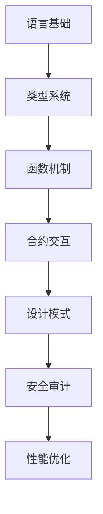

# Solidity基础语法系统性学习笔记

**学生**：朱海涛  
**学号**：2023110571  
**日期**：2024年9月16日  
**课程**：区块链智能合约开发

---

## 前言

作为一名注重理论基础的学习者，我认为深入理解Solidity的设计哲学和底层机制对于编写高质量智能合约至关重要。本笔记将从语言设计原理出发，系统性地梳理Solidity的核心概念。

---

## 第一章：语言基础与设计哲学

### 1.1 Solidity的设计目标

Solidity作为面向合约的高级编程语言，其设计遵循以下原则：

1. **确定性执行**：相同输入必须产生相同输出
2. **资源约束**：考虑Gas成本和区块大小限制
3. **安全优先**：默认安全的语言特性
4. **图灵完备**：支持复杂的计算逻辑

### 1.2 编译与执行模型

```solidity
// SPDX-License-Identifier: MIT
pragma solidity ^0.8.19;

/**
 * @title 基础合约示例
 * @dev 展示Solidity的基本结构和编译指令
 * @author 朱海涛
 */
contract BasicExample {
    // 状态变量存储在区块链上
    uint256 private _value;
    
    // 构造函数在部署时执行一次
    constructor(uint256 initialValue) {
        _value = initialValue;
    }
}
```

**理论要点**：
- 编译器将Solidity代码转换为EVM字节码
- 每个合约都有独立的存储空间和执行环境
- 状态变量的存储布局由编译器优化决定

---

## 第二章：类型系统深度分析

### 2.1 值类型的内存模型

#### 2.1.1 整数类型的表示
```solidity
// 有符号整数使用二进制补码表示
int8 public signedByte = -128;    // 0x80
int8 public maxSigned = 127;      // 0x7F

// 无符号整数直接二进制表示
uint8 public unsignedByte = 255;  // 0xFF
uint256 public maxUint = type(uint256).max; // 2^256 - 1
```

**类型转换规则**：
- 隐式转换：小类型→大类型（安全）
- 显式转换：大类型→小类型（可能截断）
- 0.8.0+版本默认检查溢出

#### 2.1.2 地址类型的特殊性
```solidity
address public contractAddr;        // 20字节地址
address payable public wallet;      // 可接收以太币的地址

// 地址类型的成员函数
function addressOperations() public view returns (uint256, bytes memory) {
    return (
        contractAddr.balance,           // 查询余额
        contractAddr.code              // 获取合约代码
    );
}
```

### 2.2 引用类型的存储位置

#### 2.2.1 数据位置的选择策略
```solidity
// 存储位置对Gas消耗的影响
struct Student {
    string name;
    uint256 score;
    bool active;
}

mapping(uint256 => Student) private students;

function updateStudent(uint256 id, string memory newName) public {
    // storage引用：直接修改状态
    Student storage student = students[id];
    student.name = newName;
    
    // memory拷贝：临时操作
    Student memory tempStudent = students[id];
    tempStudent.score = 100; // 不会影响状态
}
```

**存储位置规则**：
- `storage`：状态变量的默认位置，持久化存储
- `memory`：函数参数和局部变量的临时存储
- `calldata`：外部函数参数的只读存储

#### 2.2.2 数组的动态特性
```solidity
// 定长数组 vs 动态数组
uint256[5] public fixedArray;       // 编译时确定大小
uint256[] public dynamicArray;      // 运行时动态调整

// 数组操作的Gas分析
function arrayOperations() public {
    // push操作可能触发存储重分配
    dynamicArray.push(42);          // O(1) 平均复杂度
    
    // pop操作释放存储空间
    dynamicArray.pop();             // O(1) 复杂度
    
    // 长度修改的影响
    dynamicArray.push();            // 添加零值元素
}
```

---

## 第三章：函数机制与调用模型

### 3.1 函数可见性的访问控制

```solidity
contract AccessControl {
    uint256 private _internalState;
    
    // public：生成getter，内外部都可调用
    function publicFunction() public pure returns (string memory) {
        return "Public access";
    }
    
    // external：只能外部调用，内部需要this
    function externalFunction() external pure returns (string memory) {
        return "External only";
    }
    
    // internal：当前合约和继承合约可调用
    function _internalFunction() internal pure returns (string memory) {
        return "Internal access";
    }
    
    // private：仅当前合约可调用
    function _privateFunction() private pure returns (string memory) {
        return "Private access";
    }
}
```

### 3.2 状态可变性的语义

```solidity
// 状态可变性的层次结构：payable > nonpayable > view > pure
contract StateMutability {
    uint256 public counter;
    
    // pure：不读取也不修改状态
    function pureCalculation(uint256 a, uint256 b) public pure returns (uint256) {
        return a + b * 2;
    }
    
    // view：只读取状态，不修改
    function viewState() public view returns (uint256) {
        return counter * 2;
    }
    
    // nonpayable：修改状态，不接收以太币
    function modifyState() public {
        counter += 1;
    }
    
    // payable：修改状态，可接收以太币
    function payableFunction() public payable {
        counter += msg.value;
    }
}
```

**理论分析**：
- `pure`函数可以被编译器内联优化
- `view`函数在本地节点执行，不消耗Gas
- 状态修改函数需要矿工执行，消耗Gas

---

## 第四章：修饰符与控制流

### 4.1 修饰符的执行机制

```solidity
contract ModifierMechanics {
    address public owner;
    bool private _locked;
    
    constructor() {
        owner = msg.sender;
    }
    
    // 基础权限修饰符
    modifier onlyOwner() {
        require(msg.sender == owner, "Unauthorized");
        _;  // 占位符：被修饰函数的执行点
    }
    
    // 重入保护修饰符
    modifier nonReentrant() {
        require(!_locked, "Reentrant call");
        _locked = true;
        _;
        _locked = false;
    }
    
    // 参数化修饰符
    modifier onlyAfter(uint256 timestamp) {
        require(block.timestamp >= timestamp, "Too early");
        _;
    }
    
    // 多修饰符的执行顺序
    function restrictedFunction(uint256 deadline) 
        public 
        onlyOwner           // 第一个执行
        onlyAfter(deadline) // 第二个执行
        nonReentrant        // 第三个执行
    {
        // 函数体在所有修饰符检查通过后执行
    }
}
```

**执行流程分析**：
1. 修饰符按声明顺序执行前置检查
2. 遇到`_`时执行被修饰的函数体
3. 函数体执行完毕后，按相反顺序执行修饰符的后置代码

### 4.2 控制结构的最佳实践

```solidity
// 条件语句的优化
function optimizedConditions(uint256 value) public pure returns (string memory) {
    // 使用早期返回减少嵌套
    if (value == 0) return "Zero";
    if (value < 10) return "Small";
    if (value < 100) return "Medium";
    return "Large";
}

// 循环的Gas优化
function efficientLoop(uint256[] memory data) public pure returns (uint256) {
    uint256 sum = 0;
    uint256 length = data.length; // 缓存数组长度
    
    for (uint256 i = 0; i < length; ) {
        sum += data[i];
        unchecked { ++i; } // 避免溢出检查
    }
    
    return sum;
}
```

---

## 第五章：事件系统与日志机制

### 5.1 事件的底层实现

```solidity
contract EventSystem {
    // 事件定义：最多3个indexed参数
    event DataUpdated(
        address indexed user,      // 索引参数：可高效查询
        uint256 indexed oldValue,  // 索引参数：存储在topics中
        uint256 indexed newValue,  // 索引参数：32字节对齐
        string reason,             // 非索引参数：存储在data中
        uint256 timestamp          // 非索引参数：更节省存储
    );
    
    mapping(address => uint256) public userData;
    
    function updateData(uint256 newValue, string memory reason) public {
        uint256 oldValue = userData[msg.sender];
        userData[msg.sender] = newValue;
        
        // 触发事件：写入交易日志
        emit DataUpdated(
            msg.sender,
            oldValue,
            newValue,
            reason,
            block.timestamp
        );
    }
}
```

**日志结构分析**：
- Topics数组：[事件签名, indexed参数1, indexed参数2, indexed参数3]
- Data字段：ABI编码的非indexed参数
- 事件不占用合约存储空间，但永久记录在区块链上

---

## 第六章：错误处理与异常机制

### 6.1 错误处理的演进

```solidity
// 传统错误处理（0.8.4之前）
contract TraditionalErrors {
    function oldStyleError(uint256 value) public pure {
        require(value > 0, "Value must be positive");
        assert(value < 1000); // 内部错误检查
        
        if (value > 500) {
            revert("Value too large");
        }
    }
}

// 现代错误处理（0.8.4+）
contract ModernErrors {
    // 自定义错误：更节省Gas，提供更多信息
    error InvalidValue(uint256 provided, uint256 min, uint256 max);
    error Unauthorized(address caller, address required);
    
    address public owner;
    
    constructor() {
        owner = msg.sender;
    }
    
    function modernErrorHandling(uint256 value) public view {
        if (msg.sender != owner) {
            revert Unauthorized(msg.sender, owner);
        }
        
        if (value == 0 || value > 1000) {
            revert InvalidValue(value, 1, 1000);
        }
    }
}
```

**错误类型比较**：
- `require`：输入验证，Gas退还
- `assert`：内部错误，消耗所有Gas
- `revert`：主动回滚，可携带数据
- 自定义错误：最节省Gas，信息丰富

---

## 第七章：学习方法论与进阶路径

### 7.1 理论学习框架



### 7.2 实践学习方法

1. **渐进式复杂度**
   - 从简单合约开始
   - 逐步增加功能复杂度
   - 理解每个特性的适用场景

2. **源码阅读计划**
   - OpenZeppelin标准库
   - Uniswap核心合约
   - Compound协议实现

3. **理论验证实践**
   - 编写测试用例验证理论
   - 使用调试工具观察执行过程
   - 分析Gas消耗和优化效果

### 7.3 知识体系构建

**核心概念图谱**：
- EVM执行模型 ← Solidity语法
- 存储模型 ← 数据类型
- 调用机制 ← 函数设计
- 事件系统 ← 状态监控
- 安全模式 ← 错误处理

---

## 总结与反思

### 学习收获

通过系统性学习Solidity基础语法，我深刻认识到：

1. **语言设计的权衡**：Solidity在表达能力和安全性之间找到平衡
2. **底层机制的重要性**：理解EVM有助于编写高效代码
3. **安全意识的培养**：每个语法特性都有安全考量
4. **持续学习的必要性**：语言在快速演进，需要跟上发展

### 下阶段学习计划

1. **深入EVM原理**：理解字节码和执行机制
2. **掌握设计模式**：学习常用的智能合约设计模式
3. **安全审计实践**：参与真实项目的安全审计
4. **DeFi协议研究**：分析主流DeFi项目的实现

### 学习方法总结

- **理论先行**：先理解原理，再学习应用
- **系统思维**：将知识点串联成完整体系
- **实践验证**：通过编码验证理论理解
- **持续更新**：关注语言和生态的最新发展

---

**个人感悟**：

Solidity作为区块链时代的重要编程语言，其学习不仅是技术技能的提升，更是对去中心化思维的理解。通过系统性的学习方法，我希望能够构建扎实的理论基础，为后续的高级应用开发奠定坚实基础。

**学习座右铭**："理论指导实践，实践验证理论，在螺旋上升中不断进步。"